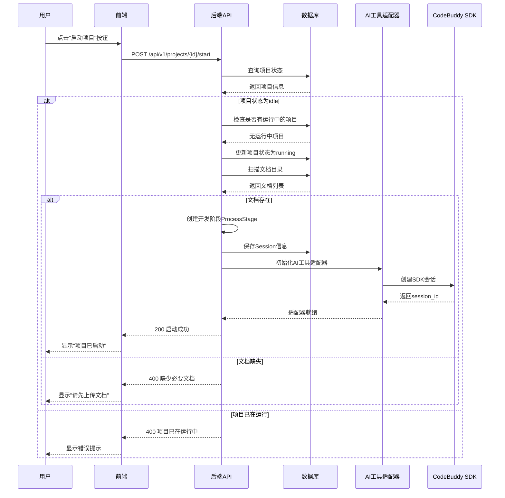
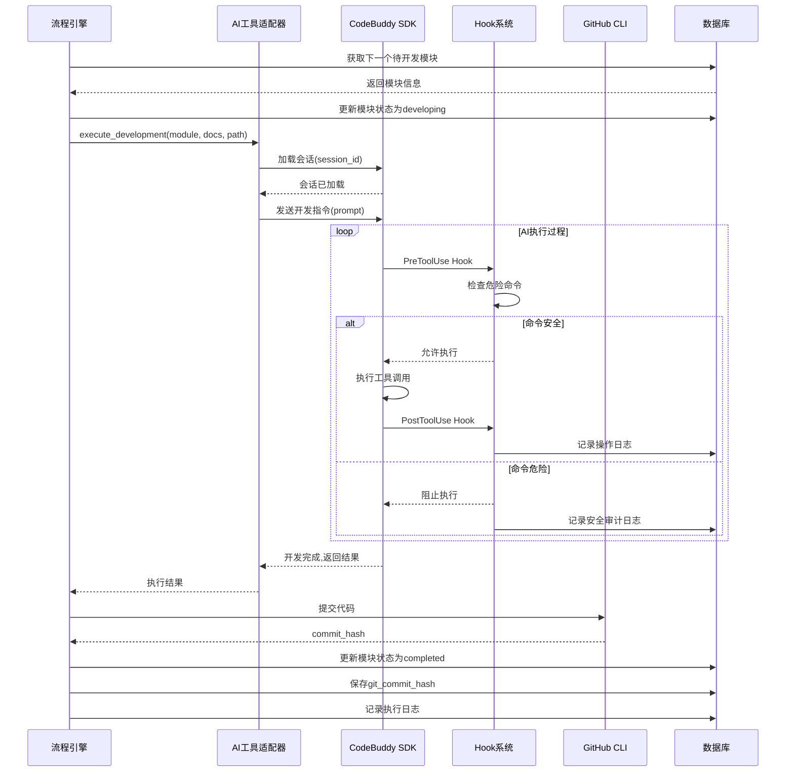
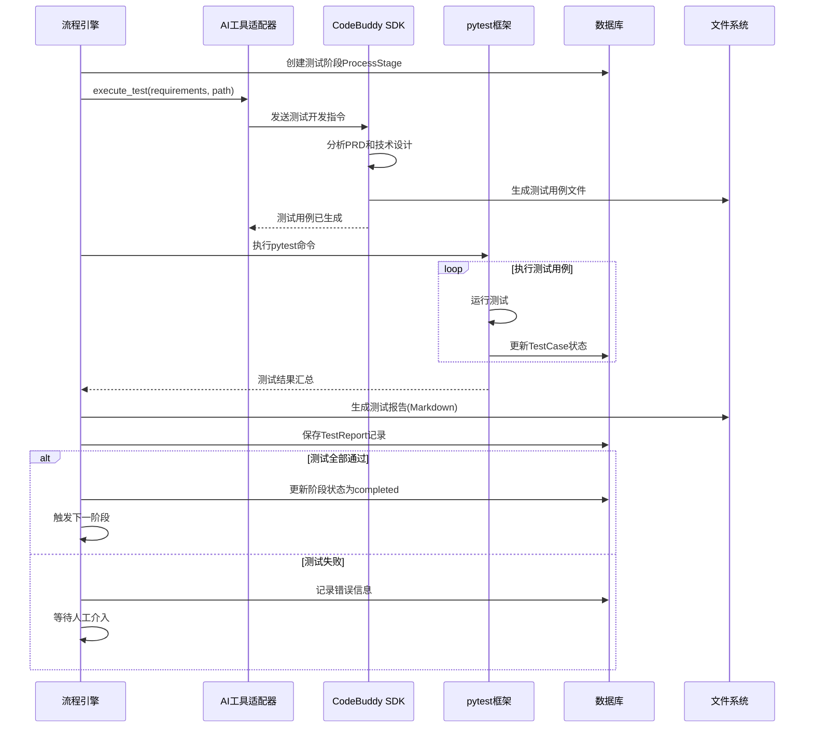
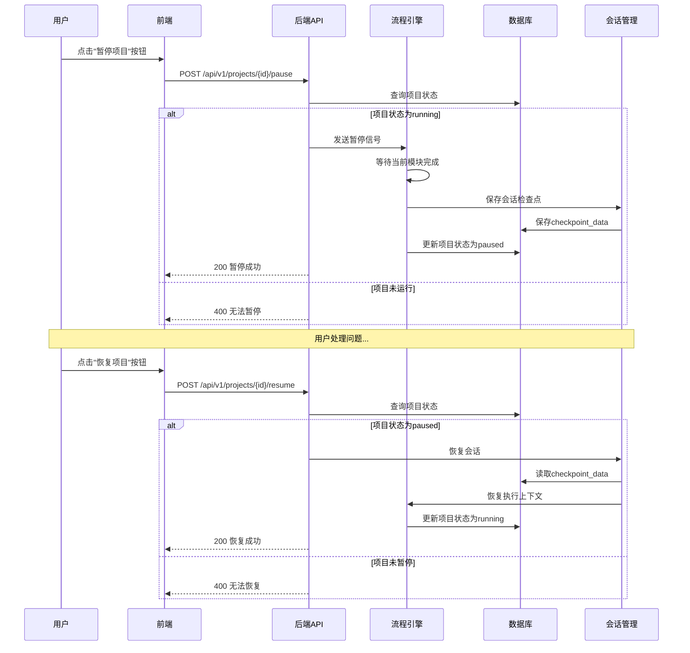
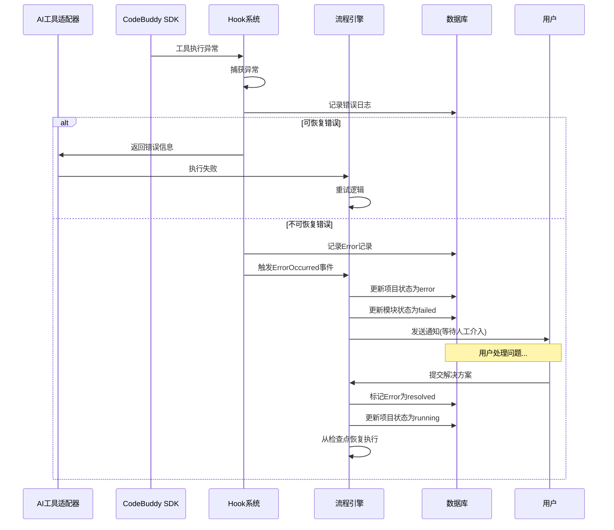
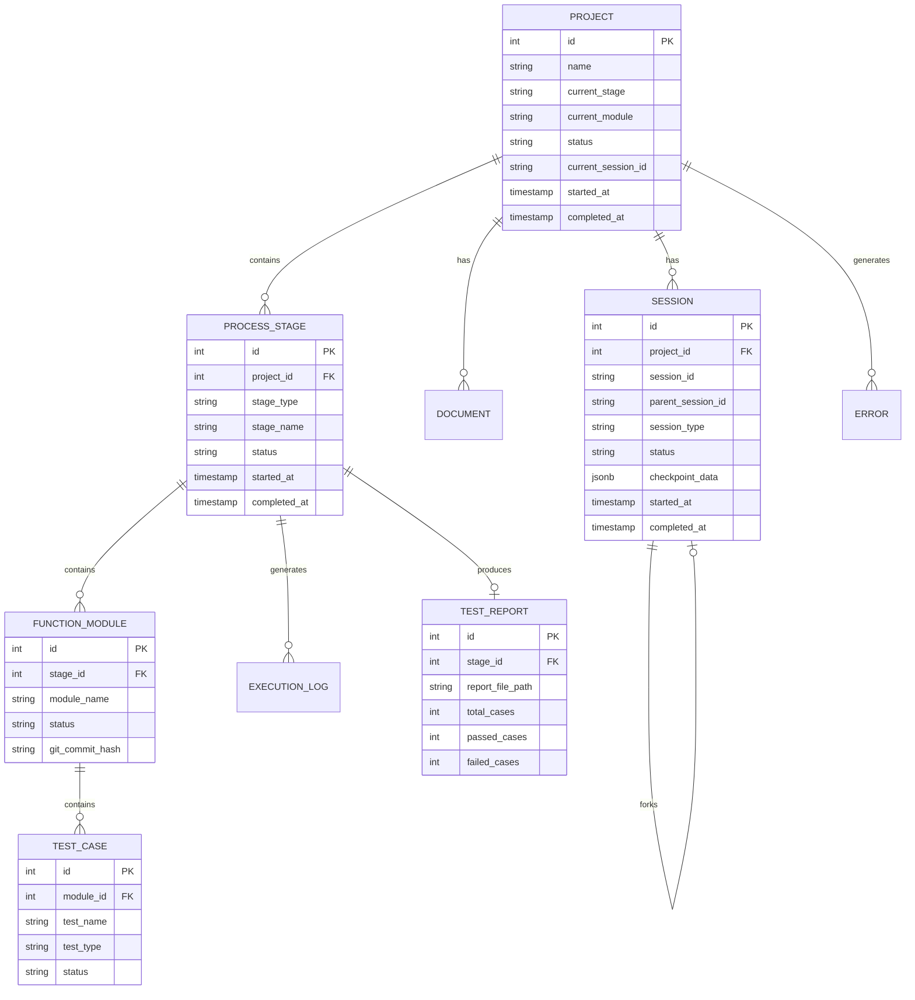
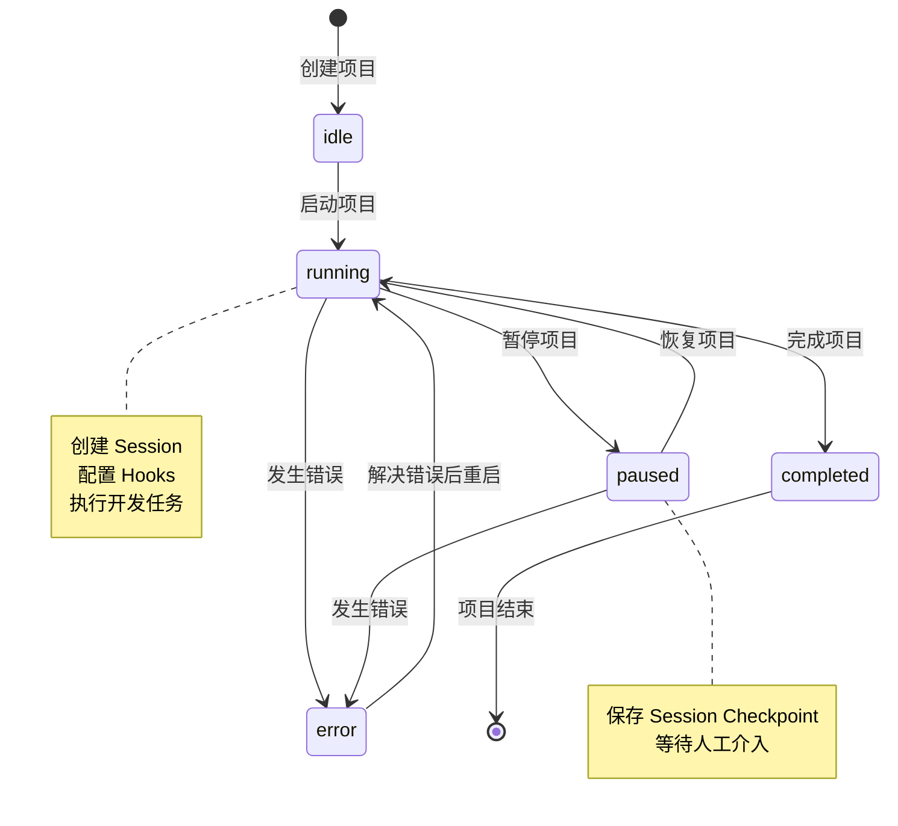

# 自动化AI编程系统 - 技术设计文档

**版本：** v1.2  
**创建日期：** 2026-04-08  
**最后更新：** 2026-04-09  
**技术栈：** Python + FastAPI + PostgreSQL + Alembic  
**架构风格：** 分层架构 + 领域驱动设计（DDD）

---

## 概述

### 技术栈选型

#### 后端技术栈

| 技术领域 | 选型 | 说明 |
|---------|------|------|
| 后端框架 | FastAPI | Python异步Web框架,高性能 |
| ORM框架 | SQLModel | 基于Pydantic的ORM,类型安全 |
| 数据库 | PostgreSQL | 开源关系型数据库,支持JSON |
| 数据迁移 | Alembic | SQLAlchemy生态的迁移工具 |
| 测试框架 | pytest | Python标准测试框架 |
| 外部工具 | codebuddy-cli, claude code | AI编程工具 |
| 代码仓库 | GitHub + gh CLI | Git仓库管理 |
| 文档格式 | Markdown | 轻量级标记语言 |

#### 前端技术栈（基于 Full Stack FastAPI Template）

| 技术领域 | 选型 | 说明 |
|---------|------|------|
| 前端框架 | React 18 + TypeScript | 现代前端开发栈 |
| 构建工具 | Vite | 快速的构建工具 |
| UI组件库 | shadcn/ui + Tailwind CSS | 实用且美观的UI组件方案 |
| 状态管理 | TanStack Query | 服务端状态管理 |
| 路由管理 | React Router | 前端路由 |
| E2E测试 | Playwright | 端到端自动化测试 |
| API客户端 | 自动生成（OpenAPI） | 基于后端OpenAPI定义自动生成 |

#### 基础设施

| 技术领域 | 选型 | 说明 |
|---------|------|------|
| 容器化 | Docker + Docker Compose | 开发与生产环境编排 |
| 反向代理 | Traefik | 自动HTTPS证书 |
| CI/CD | GitHub Actions | 自动化工作流 |
| 用户认证 | JWT + bcrypt | 安全认证方案 |

### 核心模块清单

1. **流程编排引擎** - 负责整个开发流程的状态机和流转控制
2. **工具适配器模块** - 统一封装外部AI编程工具
3. **项目管理模块** - 项目进度、状态、日志管理
4. **文档管理模块** - 文档扫描、识别、加载
5. **测试管理模块** - E2E测试执行、报告生成
6. **配置管理模块** - 系统配置、工具配置
7. **异常处理模块** - 错误捕获、日志记录、人工介入

---

## 一、领域模型

### 1.1 实体关系图（ER图）

```
┌─────────────┐
│   Project   │ (项目)
└──────┬──────┘
       │ 1:N
       │
       ├──────────────────┬──────────────────┐
       │                  │                  │
       ▼                  ▼                  ▼
┌──────────────┐   ┌─────────────┐   ┌─────────────┐
│ ProcessStage │   │  Document   │   │   Session   │ (会话)
└──────┬───────┘   └─────────────┘   └─────────────┘
       │ 1:N
       │
       ▼
┌───────────────┐
│FunctionModule │ (功能模块)
└───────┬───────┘
        │ 1:N
        │
        ├──────────────────┐
        │                  │
        ▼                  ▼
┌──────────────┐   ┌─────────────┐
│  TestCase    │   │ExecutionLog │ (执行日志)
└──────┬───────┘   └─────────────┘
       │ 1:1
       │
       ▼
┌──────────────┐
│ TestReport   │ (测试报告)
└──────────────┘

┌──────────────┐
│SystemConfig  │ (系统配置)
└──────────────┘

┌──────────────┐
│ ToolConfig   │ (工具配置)
└──────────────┘

┌──────────────┐
│  Error       │ (错误记录)
└──────────────┘
```

### 1.2 核心聚合

#### Project聚合（聚合根）
- **Project** - 项目实体
- **ProcessStage** - 流程阶段（开发、测试）
- **FunctionModule** - 功能模块
- **ExecutionLog** - 执行日志

#### Test聚合
- **TestCase** - 测试用例
- **TestReport** - 测试报告

#### 配置聚合
- **SystemConfig** - 系统配置
- **ToolConfig** - 工具配置

### 1.3 实体关系说明

| 实体A | 关系 | 实体B | 说明 |
|-------|------|-------|------|
| Project | 1:N | ProcessStage | 一个项目包含多个流程阶段 |
| ProcessStage | 1:N | FunctionModule | 一个阶段包含多个功能模块 |
| FunctionModule | 1:N | TestCase | 一个模块包含多个测试用例 |
| ProcessStage | 1:N | ExecutionLog | 一个阶段产生多条执行日志 |
| TestCase | 1:1 | TestReport | 一组测试用例生成一个报告 |
| Project | 1:N | Document | 一个项目关联多个文档 |
| Project | 1:N | Session | 一个项目可以有多个会话（支持会话分叉） |
| Session | N:1 | Session | 会话可以有父会话（会话分叉场景） |
| Project | 1:N | Error | 一个项目可能产生多个错误 |

### 1.4 领域事件

| 事件名称 | 触发时机 | 订阅者 |
|---------|---------|--------|
| ProjectStarted | 项目启动时 | 流程引擎、会话管理器 |
| StageCompleted | 阶段完成时 | 流程引擎 |
| ModuleCompleted | 模块完成时 | 流程引擎、GitHub集成、会话检查点 |
| TestCompleted | 测试完成时 | 报告生成器 |
| ErrorOccurred | 异常发生时 | 日志记录器、通知服务、会话管理器 |
| HumanInterventionRequired | 需要人工介入时 | 通知服务 |
| SessionCreated | 会话创建时 | 会话管理器 |
| SessionPaused | 会话暂停时 | 会话管理器 |
| SessionResumed | 会话恢复时 | 会话管理器 |
| CheckpointSaved | 检查点保存时 | 会话管理器、状态同步器 |
| ToolExecutionBlocked | 工具执行被拦截时 | 日志记录器、审计系统 |

---

## 二、用户认证架构设计

### 2.1 架构概述

**定位**：系统作为内部工具，MVP阶段暂不实现完整的用户认证系统，但预留扩展能力。

**设计原则**：
- 采用 JWT（JSON Web Token）认证方案
- 预留用户表和权限控制接口
- API设计遵循认证规范，便于后续扩展

### 2.2 认证流程

```
┌──────────────────────────────────────────────────────┐
│                    认证流程（预留）                    │
├──────────────────────────────────────────────────────┤
│                                                      │
│  用户登录 → 验证凭证 → 生成JWT → 返回Token          │
│                              │                       │
│                              ▼                       │
│                       携带Token访问API               │
│                              │                       │
│                              ▼                       │
│                       验证Token → 解析用户信息      │
│                              │                       │
│                              ▼                       │
│                       权限检查 → 执行业务逻辑       │
│                                                      │
└──────────────────────────────────────────────────────┘
```

### 2.3 用户表设计（预留）

| 字段名 | 类型 | 是否必填 | 默认值 | 说明 |
|--------|------|----------|--------|------|
| id | INTEGER | Y | AUTO_INCREMENT | 主键 |
| email | VARCHAR(255) | Y | - | 邮箱（登录账号） |
| hashed_password | VARCHAR(255) | Y | - | 密码哈希（bcrypt） |
| full_name | VARCHAR(255) | N | NULL | 用户全名 |
| is_active | BOOLEAN | Y | TRUE | 是否激活 |
| is_superuser | BOOLEAN | Y | FALSE | 是否超级管理员 |
| created_at | TIMESTAMP | Y | CURRENT_TIMESTAMP | 创建时间 |
| updated_at | TIMESTAMP | Y | CURRENT_TIMESTAMP | 更新时间 |

**索引设计**：
- PRIMARY KEY: `id`
- UNIQUE INDEX: `uk_email` (`email`)

### 2.4 权限控制设计

#### 权限层级

| 权限级别 | 说明 | 适用场景 |
|---------|------|---------|
| 匿名访问 | 无需认证 | MVP阶段（内部工具） |
| 普通用户 | 查看项目状态、日志 | 二期扩展 |
| 管理员 | 配置管理、项目控制 | 二期扩展 |
| 超级管理员 | 用户管理、系统管理 | 二期扩展 |

#### API权限规划

| API模块 | MVP阶段 | 二期规划 |
|---------|---------|---------|
| 项目管理 | 无需认证 | 普通用户 |
| 配置管理 | 无需认证 | 管理员 |
| 用户管理 | - | 超级管理员 |
| 日志查看 | 无需认证 | 普通用户 |

### 2.5 JWT Token 结构

**Access Token**：
- 有效期：30分钟
- 存储：内存/LocalStorage
- 用途：API请求认证

**Refresh Token**：
- 有效期：7天
- 存储：HTTP-Only Cookie
- 用途：刷新Access Token

### 2.6 安全策略

| 安全措施 | 说明 |
|---------|------|
| 密码哈希 | bcrypt算法，cost factor = 12 |
| Token过期 | Access Token短期，Refresh Token长期 |
| HTTPS | 生产环境强制HTTPS |
| CORS | 限制允许的源 |
| Rate Limiting | API请求频率限制（预留） |

---

## 三、数据库设计

### 2.1 项目表（project）

**说明**：存储项目的基本信息和进度状态。

| 字段名 | 类型 | 是否必填 | 默认值 | 说明 |
|--------|------|----------|--------|------|
| id | INTEGER | Y | AUTO_INCREMENT | 主键 |
| name | VARCHAR(255) | Y | - | 项目名称 |
| description | TEXT | N | NULL | 项目描述 |
| current_stage | VARCHAR(50) | Y | 'idle' | 当前阶段：idle/developing/testing/paused/completed |
| current_module | VARCHAR(255) | N | NULL | 当前功能模块名称 |
| status | VARCHAR(50) | Y | 'idle' | 项目状态：idle/running/paused/error/completed |
| input_document_dir | VARCHAR(500) | Y | - | 文档输入目录路径 |
| project_path | VARCHAR(500) | Y | - | 项目代码路径 |
| current_session_id | VARCHAR(100) | N | NULL | 当前活跃的会话ID（新增） |
| started_at | TIMESTAMP | N | NULL | 项目启动时间 |
| completed_at | TIMESTAMP | N | NULL | 项目完成时间 |
| created_at | TIMESTAMP | Y | CURRENT_TIMESTAMP | 创建时间 |
| updated_at | TIMESTAMP | Y | CURRENT_TIMESTAMP | 更新时间 |

**索引设计**：
- PRIMARY KEY: `id`
- INDEX: `idx_status` (`status`)
- INDEX: `idx_current_session_id` (`current_session_id`)

**字段枚举说明**：
```
current_stage:
  idle       = 空闲
  developing = 开发阶段
  testing    = 测试阶段
  paused     = 已暂停
  completed  = 已完成

status:
  idle      = 空闲
  running   = 运行中
  paused    = 已暂停
  error     = 异常
  completed = 已完成
```

---

### 2.2 流程阶段表（process_stage）

**说明**：记录项目的各个流程阶段执行情况。

| 字段名 | 类型 | 是否必填 | 默认值 | 说明 |
|--------|------|----------|--------|------|
| id | INTEGER | Y | AUTO_INCREMENT | 主键 |
| project_id | INTEGER | Y | - | 关联项目ID |
| stage_type | VARCHAR(50) | Y | - | 阶段类型：developing/testing |
| stage_name | VARCHAR(255) | Y | - | 阶段名称 |
| status | VARCHAR(50) | Y | 'pending' | 状态：pending/running/completed/failed |
| started_at | TIMESTAMP | N | NULL | 开始时间 |
| completed_at | TIMESTAMP | N | NULL | 完成时间 |
| created_at | TIMESTAMP | Y | CURRENT_TIMESTAMP | 创建时间 |
| updated_at | TIMESTAMP | Y | CURRENT_TIMESTAMP | 更新时间 |

**索引设计**：
- PRIMARY KEY: `id`
- INDEX: `idx_project_id` (`project_id`)
- INDEX: `idx_status` (`status`)

**字段枚举说明**：
```
stage_type:
  developing = 开发阶段
  testing    = 测试阶段

status:
  pending   = 待执行
  running   = 执行中
  completed = 已完成
  failed    = 失败
```

---

### 2.3 功能模块表（function_module）

**说明**：记录开发阶段的功能模块执行情况。

| 字段名 | 类型 | 是否必填 | 默认值 | 说明 |
|--------|------|----------|--------|------|
| id | INTEGER | Y | AUTO_INCREMENT | 主键 |
| stage_id | INTEGER | Y | - | 关联流程阶段ID |
| module_name | VARCHAR(255) | Y | - | 模块名称 |
| description | TEXT | N | NULL | 模块描述 |
| status | VARCHAR(50) | Y | 'pending' | 状态：pending/developing/completed/failed |
| git_commit_hash | VARCHAR(40) | N | NULL | Git提交哈希 |
| started_at | TIMESTAMP | N | NULL | 开始时间 |
| completed_at | TIMESTAMP | N | NULL | 完成时间 |
| created_at | TIMESTAMP | Y | CURRENT_TIMESTAMP | 创建时间 |
| updated_at | TIMESTAMP | Y | CURRENT_TIMESTAMP | 更新时间 |

**索引设计**：
- PRIMARY KEY: `id`
- INDEX: `idx_stage_id` (`stage_id`)

---

### 2.4 测试用例表（test_case）

**说明**：记录E2E测试用例的执行情况。

| 字段名 | 类型 | 是否必填 | 默认值 | 说明 |
|--------|------|----------|--------|------|
| id | INTEGER | Y | AUTO_INCREMENT | 主键 |
| module_id | INTEGER | Y | - | 关联功能模块ID |
| test_name | VARCHAR(255) | Y | - | 测试用例名称 |
| test_type | VARCHAR(50) | Y | - | 测试类型：positive/negative/exception |
| status | VARCHAR(50) | Y | 'pending' | 状态：pending/running/passed/failed |
| error_message | TEXT | N | NULL | 错误信息 |
| started_at | TIMESTAMP | N | NULL | 开始时间 |
| completed_at | TIMESTAMP | N | NULL | 完成时间 |
| created_at | TIMESTAMP | Y | CURRENT_TIMESTAMP | 创建时间 |
| updated_at | TIMESTAMP | Y | CURRENT_TIMESTAMP | 更新时间 |

**索引设计**：
- PRIMARY KEY: `id`
- INDEX: `idx_module_id` (`module_id`)

**字段枚举说明**：
```
test_type:
  positive  = 正向流程
  negative  = 反向流程
  exception = 异常流程

status:
  pending = 待执行
  running = 执行中
  passed  = 通过
  failed  = 失败
```

---

### 2.5 测试报告表（test_report）

**说明**：存储每轮测试的汇总报告。

| 字段名 | 类型 | 是否必填 | 默认值 | 说明 |
|--------|------|----------|--------|------|
| id | INTEGER | Y | AUTO_INCREMENT | 主键 |
| stage_id | INTEGER | Y | - | 关联测试阶段ID |
| report_file_path | VARCHAR(500) | Y | - | 报告文件路径（Markdown文件） |
| total_cases | INTEGER | Y | 0 | 总测试用例数 |
| passed_cases | INTEGER | Y | 0 | 通过用例数 |
| failed_cases | INTEGER | Y | 0 | 失败用例数 |
| status | VARCHAR(50) | Y | 'pending' | 报告状态：pending/completed |
| created_at | TIMESTAMP | Y | CURRENT_TIMESTAMP | 创建时间 |

**索引设计**：
- PRIMARY KEY: `id`
- INDEX: `idx_stage_id` (`stage_id`)

---

### 2.6 执行日志表（execution_log）

**说明**：记录系统执行过程中的详细日志。

| 字段名 | 类型 | 是否必填 | 默认值 | 说明 |
|--------|------|----------|--------|------|
| id | INTEGER | Y | AUTO_INCREMENT | 主键 |
| stage_id | INTEGER | Y | - | 关联流程阶段ID |
| log_level | VARCHAR(20) | Y | 'INFO' | 日志级别：DEBUG/INFO/WARNING/ERROR |
| message | TEXT | Y | - | 日志消息 |
| metadata | JSONB | N | NULL | 额外元数据（JSON格式） |
| created_at | TIMESTAMP | Y | CURRENT_TIMESTAMP | 创建时间 |

**索引设计**：
- PRIMARY KEY: `id`
- INDEX: `idx_stage_id` (`stage_id`)
- INDEX: `idx_log_level` (`log_level`)
- INDEX: `idx_created_at` (`created_at`)

---

### 2.7 文档表（document）

**说明**：存储项目关联的文档信息。

| 字段名 | 类型 | 是否必填 | 默认值 | 说明 |
|--------|------|----------|--------|------|
| id | INTEGER | Y | AUTO_INCREMENT | 主键 |
| project_id | INTEGER | Y | - | 关联项目ID |
| doc_type | VARCHAR(50) | Y | - | 文档类型：prd/design/prototype/test_report |
| file_path | VARCHAR(500) | Y | - | 文档文件路径 |
| file_name | VARCHAR(255) | Y | - | 文档文件名 |
| status | VARCHAR(50) | Y | 'pending' | 状态：pending/loaded/error |
| created_at | TIMESTAMP | Y | CURRENT_TIMESTAMP | 创建时间 |
| updated_at | TIMESTAMP | Y | CURRENT_TIMESTAMP | 更新时间 |

**索引设计**：
- PRIMARY KEY: `id`
- INDEX: `idx_project_id` (`project_id`)

---

### 2.8 系统配置表（system_config）

**说明**：存储系统级别的配置参数。

| 字段名 | 类型 | 是否必填 | 默认值 | 说明 |
|--------|------|----------|--------|------|
| id | INTEGER | Y | AUTO_INCREMENT | 主键 |
| config_key | VARCHAR(100) | Y | - | 配置键（唯一） |
| config_value | TEXT | Y | - | 配置值 |
| description | TEXT | N | NULL | 配置说明 |
| created_at | TIMESTAMP | Y | CURRENT_TIMESTAMP | 创建时间 |
| updated_at | TIMESTAMP | Y | CURRENT_TIMESTAMP | 更新时间 |

**索引设计**：
- PRIMARY KEY: `id`
- UNIQUE INDEX: `uk_config_key` (`config_key`)

**预置配置项**：

| 配置键 | 默认值 | 说明 |
|--------|--------|------|
| active_tool | codebuddy-cli | 当前激活的AI编程工具 |
| max_concurrent_modules | 1 | 最大并发模块数（MVP为1） |
| auto_commit_enabled | true | 是否自动提交代码 |
| log_level | INFO | 系统日志级别 |
| docs_directory | ./docs | 文档存储目录 |

---

### 2.9 工具配置表（tool_config）

**说明**：存储外部AI编程工具的配置信息。

| 字段名 | 类型 | 是否必填 | 默认值 | 说明 |
|--------|------|----------|--------|------|
| id | INTEGER | Y | AUTO_INCREMENT | 主键 |
| tool_name | VARCHAR(100) | Y | - | 工具名称：codebuddy/claude-code |
| tool_type | VARCHAR(50) | Y | - | 工具类型：sdk |
| config_json | JSONB | Y | - | 工具配置（JSON格式） |
| is_active | BOOLEAN | Y | FALSE | 是否激活 |
| created_at | TIMESTAMP | Y | CURRENT_TIMESTAMP | 创建时间 |
| updated_at | TIMESTAMP | Y | CURRENT_TIMESTAMP | 更新时间 |

**索引设计**：
- PRIMARY KEY: `id`
- UNIQUE INDEX: `uk_tool_name` (`tool_name`)

**config_json 配置示例（CodeBuddy SDK）**：

```json
{
  "model": "deepseek-v3.1",
  "permission_mode": "acceptEdits",
  "allowed_tools": ["Read", "Write", "Edit", "Bash", "Glob", "Grep"],
  "disallowed_tools": [],
  "max_turns": 20,
  "hooks": {
    "PreToolUse": [
      {
        "matcher": "Bash",
        "enabled": true,
        "timeout": 10
      }
    ],
    "PostToolUse": [
      {
        "matcher": "Write|Edit",
        "enabled": true
      }
    ],
    "unstable_Checkpoint": [
      {
        "enabled": true
      }
    ]
  },
  "can_use_tool_callback": true,
  "fallback_model": "deepseek-v3",
  "cwd": null,
  "env": {},
  "extra_args": []
}
```

**config_json 配置字段说明**：

| 字段 | 类型 | 必填 | 说明 |
|------|------|------|------|
| model | string | Y | AI 模型名称（如 deepseek-v3.1） |
| permission_mode | string | N | 权限模式（default/acceptEdits/plan/bypassPermissions） |
| allowed_tools | array | N | 允许的工具列表 |
| disallowed_tools | array | N | 禁止的工具列表 |
| max_turns | integer | N | 最大对话轮数 |
| hooks | object | N | Hook 配置 |
| can_use_tool_callback | boolean | N | 是否启用自定义权限回调 |
| fallback_model | string | N | 备用模型名称 |
| cwd | string | N | 工作目录（null 表示使用项目路径） |
| env | object | N | 环境变量 |
| extra_args | array | N | 额外的 CLI 参数 |

---

### 2.10 会话表（session）

**说明**：存储 CodeBuddy SDK 的会话信息,支持会话恢复和分叉。

| 字段名 | 类型 | 是否必填 | 默认值 | 说明 |
|--------|------|----------|--------|------|
| id | INTEGER | Y | AUTO_INCREMENT | 主键 |
| project_id | INTEGER | Y | - | 关联项目ID |
| session_id | VARCHAR(100) | Y | - | SDK会话ID（唯一） |
| parent_session_id | VARCHAR(100) | N | NULL | 父会话ID（用于会话分叉） |
| session_type | VARCHAR(50) | Y | - | 会话类型：developing/testing/review |
| status | VARCHAR(50) | Y | 'active' | 状态：active/paused/completed |
| checkpoint_data | JSONB | N | NULL | 检查点数据（JSON格式） |
| started_at | TIMESTAMP | Y | CURRENT_TIMESTAMP | 会话开始时间 |
| completed_at | TIMESTAMP | N | NULL | 会话完成时间 |
| created_at | TIMESTAMP | Y | CURRENT_TIMESTAMP | 创建时间 |
| updated_at | TIMESTAMP | Y | CURRENT_TIMESTAMP | 更新时间 |

**索引设计**：
- PRIMARY KEY: `id`
- INDEX: `idx_project_id` (`project_id`)
- UNIQUE INDEX: `uk_session_id` (`session_id`)

**字段枚举说明**：
```
session_type:
  developing = 开发会话
  testing    = 测试会话
  review     = 代码审查会话

status:
  active    = 活跃
  paused    = 已暂停
  completed = 已完成
```

**checkpoint_data 数据结构示例**：

```json
{
  "current_step": "module_auth_development",
  "completed_modules": ["user_model", "auth_controller"],
  "files_modified": [
    "/path/to/auth.py",
    "/path/to/models.py"
  ],
  "git_commits": ["abc123", "def456"],
  "last_prompt": "实现用户登录功能",
  "conversation_turn": 5,
  "metadata": {
    "lines_added": 234,
    "lines_deleted": 45
  }
}
```

---

### 2.11 错误记录表（error）

**说明**：记录系统运行过程中发生的错误信息。

| 字段名 | 类型 | 是否必填 | 默认值 | 说明 |
|--------|------|----------|--------|------|
| id | INTEGER | Y | AUTO_INCREMENT | 主键 |
| project_id | INTEGER | Y | - | 关联项目ID |
| error_type | VARCHAR(100) | Y | - | 错误类型 |
| error_message | TEXT | Y | - | 错误消息 |
| error_context | JSONB | N | NULL | 错误上下文（JSON格式） |
| stack_trace | TEXT | N | NULL | 堆栈跟踪 |
| status | VARCHAR(50) | Y | 'unresolved' | 状态：unresolved/resolved |
| resolved_at | TIMESTAMP | N | NULL | 解决时间 |
| created_at | TIMESTAMP | Y | CURRENT_TIMESTAMP | 创建时间 |

**索引设计**：
- PRIMARY KEY: `id`
- INDEX: `idx_project_id` (`project_id`)
- INDEX: `idx_status` (`status`)

---

## 四、API接口设计

### 4.1 API接口总览

#### 项目管理模块（Project）

| Method | URL | 描述 | 认证 |
|--------|-----|------|------|
| POST | /api/v1/projects | 创建项目 | 无 |
| GET | /api/v1/projects/current | 获取当前项目 | 无 |
| GET | /api/v1/projects/{id} | 获取项目详情 | 无 |
| POST | /api/v1/projects/{id}/start | 启动项目 | 无 |
| POST | /api/v1/projects/{id}/pause | 暂停项目 | 无 |
| POST | /api/v1/projects/{id}/resume | 恢复项目 | 无 |
| POST | /api/v1/projects/{id}/restart | 重启项目 | 无 |

#### 流程阶段模块（Stage）

| Method | URL | 描述 | 认证 |
|--------|-----|------|------|
| GET | /api/v1/projects/{project_id}/stages | 获取项目的所有阶段 | 无 |
| GET | /api/v1/stages/{id} | 获取阶段详情 | 无 |

#### 功能模块模块（Module）

| Method | URL | 描述 | 认证 |
|--------|-----|------|------|
| GET | /api/v1/stages/{stage_id}/modules | 获取阶段的所有模块 | 无 |
| GET | /api/v1/modules/{id} | 获取模块详情 | 无 |

#### 测试管理模块（Test）

| Method | URL | 描述 | 认证 |
|--------|-----|------|------|
| GET | /api/v1/modules/{module_id}/test-cases | 获取模块的测试用例 | 无 |
| GET | /api/v1/stages/{stage_id}/test-report | 获取测试报告 | 无 |
| GET | /api/v1/test-reports/{id} | 获取测试报告详情 | 无 |

#### 日志模块（Log）

| Method | URL | 描述 | 认证 |
|--------|-----|------|------|
| GET | /api/v1/stages/{stage_id}/logs | 获取阶段的执行日志 | 无 |
| GET | /api/v1/projects/{project_id}/logs | 获取项目的执行日志 | 无 |

#### 配置管理模块（Config）

| Method | URL | 描述 | 认证 |
|--------|-----|------|------|
| GET | /api/v1/configs | 获取所有系统配置 | 无 |
| PUT | /api/v1/configs/{key} | 更新系统配置 | 无 |
| GET | /api/v1/tools | 获取所有工具配置 | 无 |
| POST | /api/v1/tools | 创建工具配置 | 无 |
| PUT | /api/v1/tools/{id} | 更新工具配置 | 无 |
| DELETE | /api/v1/tools/{id} | 删除工具配置 | 无 |
| POST | /api/v1/tools/{id}/activate | 激活工具 | 无 |

#### 文档管理模块（Document）

| Method | URL | 描述 | 认证 |
|--------|-----|------|------|
| GET | /api/v1/projects/{project_id}/documents | 获取项目的文档列表 | 无 |
| POST | /api/v1/projects/{project_id}/documents/scan | 扫描文档目录 | 无 |
| GET | /api/v1/documents/{id} | 获取文档详情 | 无 |

---

### 3.2 核心接口详细定义

#### POST /api/v1/projects

**描述**：创建新项目

**认证**：无需认证（内部工具）

**请求体**（application/json）：

```json
{
  "name": "string",              // 项目名称，必填
  "description": "string",       // 项目描述，可选
  "input_document_dir": "string", // 文档输入目录，必填
  "project_path": "string"       // 项目代码路径，必填
}
```

**请求参数说明**：

| 参数 | 类型 | 必填 | 说明 |
|------|------|------|------|
| name | string | Y | 项目名称 |
| description | string | N | 项目描述 |
| input_document_dir | string | Y | 文档输入目录路径 |
| project_path | string | Y | 项目代码路径 |

**响应示例（200 OK）**：

```json
{
  "code": 0,
  "message": "success",
  "data": {
    "id": 1,
    "name": "电商系统",
    "description": "基于FastAPI的电商系统",
    "current_stage": "idle",
    "current_module": null,
    "status": "idle",
    "input_document_dir": "/data/projects/ecom/docs",
    "project_path": "/data/projects/ecom",
    "created_at": "2026-04-08T10:00:00Z"
  }
}
```

---

#### GET /api/v1/projects/current

**描述**：获取当前运行的项目

**认证**：无需认证

**响应示例（200 OK）**：

```json
{
  "code": 0,
  "message": "success",
  "data": {
    "id": 1,
    "name": "电商系统",
    "current_stage": "developing",
    "current_module": "用户认证模块",
    "status": "running",
    "started_at": "2026-04-08T10:00:00Z",
    "created_at": "2026-04-08T09:00:00Z"
  }
}
```

**错误响应**：

| HTTP状态码 | code | message | 场景 |
|-----------|------|---------|------|
| 404 | 40401 | 当前没有运行的项目 | 无项目运行 |

---

#### POST /api/v1/projects/{id}/start

**描述**：启动项目流程

**认证**：无需认证

**路径参数**：

| 参数 | 类型 | 必填 | 说明 |
|------|------|------|------|
| id | integer | Y | 项目ID |

**响应示例（200 OK）**：

```json
{
  "code": 0,
  "message": "success",
  "data": {
    "project_id": 1,
    "status": "running",
    "current_stage": "developing",
    "started_at": "2026-04-08T10:00:00Z"
  }
}
```

**错误响应**：

| HTTP状态码 | code | message | 场景 |
|-----------|------|---------|------|
| 400 | 40001 | 项目已在运行中 | 项目status为running |
| 400 | 40002 | 项目缺少必要文档 | 文档目录为空或无法识别 |
| 404 | 40401 | 项目不存在 | 项目ID无效 |

---

#### POST /api/v1/projects/{id}/pause

**描述**：暂停项目流程

**认证**：无需认证

**路径参数**：

| 参数 | 类型 | 必填 | 说明 |
|------|------|------|------|
| id | integer | Y | 项目ID |

**响应示例（200 OK）**：

```json
{
  "code": 0,
  "message": "success",
  "data": {
    "project_id": 1,
    "status": "paused",
    "paused_at": "2026-04-08T11:00:00Z"
  }
}
```

---

#### GET /api/v1/stages/{id}/modules

**描述**：获取阶段的所有功能模块

**认证**：无需认证

**路径参数**：

| 参数 | 类型 | 必填 | 说明 |
|------|------|------|------|
| id | integer | Y | 阶段ID |

**响应示例（200 OK）**：

```json
{
  "code": 0,
  "message": "success",
  "data": {
    "list": [
      {
        "id": 1,
        "module_name": "用户认证模块",
        "status": "completed",
        "git_commit_hash": "abc123def456",
        "started_at": "2026-04-08T10:00:00Z",
        "completed_at": "2026-04-08T10:30:00Z"
      },
      {
        "id": 2,
        "module_name": "商品管理模块",
        "status": "developing",
        "started_at": "2026-04-08T10:30:00Z"
      }
    ],
    "total": 2
  }
}
```

---

#### GET /api/v1/stages/{stage_id}/test-report

**描述**：获取测试阶段的测试报告

**认证**：无需认证

**路径参数**：

| 参数 | 类型 | 必填 | 说明 |
|------|------|------|------|
| stage_id | integer | Y | 阶段ID |

**响应示例（200 OK）**：

```json
{
  "code": 0,
  "message": "success",
  "data": {
    "id": 1,
    "stage_id": 5,
    "report_file_path": "/data/projects/ecom/docs/test-report-20260408-1.md",
    "total_cases": 15,
    "passed_cases": 12,
    "failed_cases": 3,
    "status": "completed",
    "created_at": "2026-04-08T12:00:00Z"
  }
}
```

---

#### GET /api/v1/stages/{stage_id}/logs

**描述**：获取阶段的执行日志

**认证**：无需认证

**路径参数**：

| 参数 | 类型 | 必填 | 说明 |
|------|------|------|------|
| stage_id | integer | Y | 阶段ID |

**查询参数**：

| 参数 | 类型 | 必填 | 默认值 | 说明 |
|------|------|------|--------|------|
| page | integer | N | 1 | 页码 |
| page_size | integer | N | 100 | 每页数量 |
| log_level | string | N | - | 日志级别过滤 |

**响应示例**：

```json
{
  "code": 0,
  "message": "success",
  "data": {
    "list": [
      {
        "id": 1,
        "log_level": "INFO",
        "message": "开始执行模块：用户认证模块",
        "created_at": "2026-04-08T10:00:00Z"
      },
      {
        "id": 2,
        "log_level": "INFO",
        "message": "调用AI工具：codebuddy-cli",
        "metadata": {
          "tool": "codebuddy-cli",
          "command": "develop --module auth"
        },
        "created_at": "2026-04-08T10:00:05Z"
      }
    ],
    "total": 50,
    "page": 1,
    "page_size": 100
  }
}
```

---

#### PUT /api/v1/configs/{key}

**描述**：更新系统配置

**认证**：无需认证

**路径参数**：

| 参数 | 类型 | 必填 | 说明 |
|------|------|------|------|
| key | string | Y | 配置键名 |

**请求体**（application/json）：

```json
{
  "config_value": "string"  // 新的配置值，必填
}
```

**响应示例（200 OK）**：

```json
{
  "code": 0,
  "message": "success",
  "data": {
    "config_key": "active_tool",
    "config_value": "claude-code",
    "updated_at": "2026-04-08T14:00:00Z"
  }
}
```

---

#### POST /api/v1/tools/{id}/activate

**描述**：激活指定的工具配置

**认证**：无需认证

**路径参数**：

| 参数 | 类型 | 必填 | 说明 |
|------|------|------|------|
| id | integer | Y | 工具配置ID |

**响应示例（200 OK）**：

```json
{
  "code": 0,
  "message": "success",
  "data": {
    "id": 1,
    "tool_name": "codebuddy-cli",
    "is_active": true,
    "updated_at": "2026-04-08T14:00:00Z"
  }
}
```

---

### 3.3 统一响应结构

所有接口返回统一的 JSON 结构：

```json
{
  "code": 0,
  "message": "success",
  "data": { ... }
}
```

**分页响应结构**：

```json
{
  "code": 0,
  "message": "success",
  "data": {
    "list": [ ... ],
    "total": 100,
    "page": 1,
    "page_size": 20
  }
}
```

**错误响应结构**：

```json
{
  "code": 40001,
  "message": "资源不存在",
  "data": null
}
```

### 3.4 错误码规范

| HTTP状态码 | 业务错误码 | message | 场景 |
|-----------|-----------|---------|------|
| 200 | 0 | success | 操作成功 |
| 400 | 40000 | 参数校验失败 | 缺少必填字段 |
| 400 | 40001 | 项目已在运行中 | 重复启动 |
| 400 | 40002 | 项目缺少必要文档 | 文档缺失 |
| 404 | 40401 | 资源不存在 | 项目/阶段/模块不存在 |
| 409 | 40901 | 已存在运行中的项目 | 单项目限制 |
| 500 | 50000 | 服务器内部错误 | 系统异常 |
| 500 | 50001 | 外部工具调用失败 | AI工具异常 |
| 500 | 50002 | Git操作失败 | GitHub集成异常 |

---

## 四、前端技术架构设计

### 4.1 架构概述

**技术选型依据**：基于 Full Stack FastAPI Template，采用 React + TypeScript + Vite 技术栈。

**核心特性**：
- 类型安全：TypeScript 全栈类型共享
- 组件化：shadcn/ui 组件库，可定制性强
- 自动生成：基于 OpenAPI 自动生成 API 客户端
- 开发体验：Vite 热更新，开发效率高

### 4.2 技术架构图

```
┌─────────────────────────────────────────────────────────┐
│                    前端应用架构                          │
├─────────────────────────────────────────────────────────┤
│                                                         │
│  ┌─────────────────────────────────────────────────┐   │
│  │                  页面层 (Pages)                   │   │
│  │  ├─ Dashboard   ├─ Projects   ├─ Configs        │   │
│  │  ├─ Logs        ├─ Tests      └─ Documents      │   │
│  └─────────────────────────────────────────────────┘   │
│                          │                              │
│  ┌─────────────────────────────────────────────────┐   │
│  │                组件层 (Components)                │   │
│  │  ├─ Layout      ├─ Common     ├─ Business       │   │
│  │  └─ shadcn/ui 组件库（Button, Card, Table...）   │   │
│  └─────────────────────────────────────────────────┘   │
│                          │                              │
│  ┌─────────────────────────────────────────────────┐   │
│  │                状态管理层 (State)                 │   │
│  │  ├─ TanStack Query（服务端状态）                  │   │
│  │  └─ React Context（客户端状态）                   │   │
│  └─────────────────────────────────────────────────┘   │
│                          │                              │
│  ┌─────────────────────────────────────────────────┐   │
│  │                API层 (Auto-generated)            │   │
│  │  └─ 基于后端 OpenAPI 自动生成 TypeScript 客户端   │   │
│  └─────────────────────────────────────────────────┘   │
│                                                         │
└─────────────────────────────────────────────────────────┘
```

### 4.3 目录结构规范

```
frontend/
├── src/
│   ├── app/                    # 自动生成的API客户端
│   │   ├── client/             # API请求客户端
│   │   └── models/             # TypeScript类型定义
│   ├── components/             # 可复用UI组件
│   │   ├── ui/                 # shadcn/ui 组件
│   │   ├── layout/             # 布局组件
│   │   └── common/             # 通用业务组件
│   ├── pages/                  # 路由页面
│   │   ├── dashboard/          # 仪表盘页面
│   │   ├── projects/           # 项目管理页面
│   │   ├── configs/            # 配置管理页面
│   │   ├── logs/               # 日志查看页面
│   │   └── tests/              # 测试报告页面
│   ├── hooks/                  # 自定义Hooks
│   ├── lib/                    # 工具函数
│   ├── styles/                 # 全局样式
│   ├── main.tsx                # 应用入口
│   └── routeTree.gen.ts        # 自动生成路由
├── public/                     # 静态资源
├── vite.config.ts              # Vite配置
├── tailwind.config.ts          # Tailwind配置
└── tsconfig.json               # TypeScript配置
```

### 4.4 页面路由设计

| 路由 | 页面 | 说明 |
|------|------|------|
| `/` | Dashboard | 首页仪表盘，展示项目概览 |
| `/projects` | ProjectList | 项目列表页面 |
| `/projects/:id` | ProjectDetail | 项目详情页面 |
| `/projects/:id/logs` | ProjectLogs | 项目执行日志 |
| `/configs` | ConfigList | 系统配置管理 |
| `/tools` | ToolList | 工具配置管理 |
| `/tests/:id` | TestReport | 测试报告详情 |

### 4.5 核心页面设计

#### 4.5.1 Dashboard 页面

**功能**：项目概览、快速操作

**布局**：

```
┌────────────────────────────────────────────┐
│  Header: Logo + 用户信息 + 暗黑模式切换    │
├────────────────────────────────────────────┤
│                                            │
│  ┌──────────────┐  ┌──────────────────┐   │
│  │ 当前项目状态  │  │ 快速操作面板     │   │
│  │ - 项目名称   │  │ - 启动项目       │   │
│  │ - 当前阶段   │  │ - 暂停项目       │   │
│  │ - 运行状态   │  │ - 查看日志       │   │
│  └──────────────┘  └──────────────────┘   │
│                                            │
│  ┌──────────────────────────────────────┐ │
│  │ 执行日志实时流（WebSocket）           │ │
│  │ ...                                   │ │
│  └──────────────────────────────────────┘ │
│                                            │
└────────────────────────────────────────────┘
```

#### 4.5.2 ProjectDetail 页面

**功能**：项目详情、模块进度、操作控制

**布局**：

```
┌────────────────────────────────────────────┐
│  项目名称 + 状态标签 + 操作按钮             │
├────────────────────────────────────────────┤
│                                            │
│  Tab: 概览 | 模块进度 | 测试报告 | 文档     │
│                                            │
│  ┌──────────────────────────────────────┐ │
│  │ 模块进度列表                          │ │
│  │ ├─ 模块A [completed] ✓                │ │
│  │ ├─ 模块B [developing] ⏳              │ │
│  │ └─ 模块C [pending] ○                  │ │
│  └──────────────────────────────────────┘ │
│                                            │
└────────────────────────────────────────────┘
```

### 4.6 API客户端自动生成

**生成方式**：基于后端 OpenAPI 规范自动生成 TypeScript 客户端

**生成流程**：

```
后端 FastAPI
    │
    ▼
OpenAPI JSON Schema (自动生成)
    │
    ▼
openapi-typescript-codegen
    │
    ▼
前端 TypeScript API Client
    │
    ├─ 类型定义 (models/)
    └─ 请求方法 (services/)
```

**优势**：
- 前后端类型一致性
- API变更自动感知
- 减少手动编写代码

### 4.7 前后端交互规范

#### 4.7.1 API请求规范

| 规范项 | 说明 |
|--------|------|
| 基础URL | `/api/v1` |
| 认证方式 | Authorization: Bearer {token} |
| 请求格式 | application/json |
| 响应格式 | `{ code: number, message: string, data: any }` |
| 错误处理 | 统一错误码映射 |

#### 4.7.2 实时通信

| 场景 | 方案 |
|------|------|
| 执行日志实时流 | WebSocket |
| 项目状态变更 | WebSocket / SSE |
| 进度更新 | 轮询 / WebSocket |

### 4.8 UI组件规范

#### 4.8.1 shadcn/ui 核心组件

| 组件 | 用途 |
|------|------|
| Button | 操作按钮 |
| Card | 信息卡片 |
| Table | 数据表格 |
| Dialog | 弹窗 |
| Tabs | 标签页切换 |
| Badge | 状态标签 |
| Progress | 进度条 |
| Toast | 消息提示 |

#### 4.8.2 主题配置

- 支持 Light / Dark 模式切换
- 基于 CSS Variables 实现
- Tailwind CSS 定制主题色

---

## 五、公共模块设计

### 5.1 基础架构层

#### 4.1.1 分层架构说明

系统采用三层架构设计，职责划分如下：

```
┌─────────────────────────────────────────────────┐
│                   API Layer                      │
│  职责：接收请求、参数校验、响应格式化              │
│  位置：app/api/v1/                              │
├─────────────────────────────────────────────────┤
│                  Service Layer                   │
│  职责：业务逻辑、事务管理、跨模块协调              │
│  位置：app/services/                            │
├─────────────────────────────────────────────────┤
│                Repository Layer                  │
│  职责：数据访问、SQL生成、缓存管理                │
│  位置：app/repositories/                        │
└─────────────────────────────────────────────────┘
```

#### 4.1.2 基础模型规范

| 基类 | 位置 | 职责 | 提供能力 |
|------|------|------|---------|
| BaseModel | app/models/base.py | 所有实体的基类 | id、created_at、updated_at 公共字段 |
| BaseRepository | app/repositories/base.py | 数据访问基类 | CRUD通用操作、分页查询 |
| BaseService | app/services/base.py | 业务服务基类 | 异常处理、日志记录、事务管理 |

**接口契约**：

| 操作 | BaseRepository | BaseService |
|------|---------------|-------------|
| 单条查询 | `get(id) -> Model` | `get_by_id(id) -> DTO` |
| 列表查询 | `get_all(skip, limit) -> List[Model]` | `list(page, size) -> PageResult` |
| 创建 | `create(obj_in) -> Model` | `create(dto) -> DTO` |
| 更新 | `update(model, obj_in) -> Model` | `update(id, dto) -> DTO` |
| 删除 | `delete(id) -> bool` | `delete(id) -> bool` |

---

### 5.2 设计模式应用

#### 5.2.1 适配器模式（Adapter Pattern）

**应用场景**：外部AI编程工具适配器（REQ-002）

**位置**：`app/adapters/ai_tool_adapter.py`

**使用理由**：
- 需要集成多种外部AI编程工具（codebuddy、claude code等）
- 不同工具的接口和调用方式不同
- 需要统一接口，降低系统耦合度
- 便于后续扩展新的工具

**设计结构**：

```
┌─────────────────────────────────────────────────────┐
│                  AIToolAdapter                       │
│                   (抽象接口)                          │
├─────────────────────────────────────────────────────┤
│ + execute_development(module, doc, path) → Result   │
│ + execute_test(requirements, path) → Result         │
│ + stream_response(prompt, session) → Iterator       │
│ + configure_hooks(config) → void                    │
│ + configure_permissions(config) → void              │
└─────────────────┬───────────────────────────────────┘
                  │
        ┌─────────┴─────────┐
        │                   │
        ▼                   ▼
┌───────────────┐   ┌───────────────┐
│ Codebuddy     │   │ ClaudeCode    │
│ Adapter       │   │ Adapter       │
├───────────────┤   ├───────────────┤
│ SDK: Python   │   │ SDK: 待定     │
│ 异步: asyncio │   │               │
└───────────────┘   └───────────────┘
```

**统一接口契约**：

| 方法 | 入参 | 出参 | 说明 |
|------|------|------|------|
| execute_development | module_name, design_doc, project_path, session_id | ToolExecutionResult | 执行开发任务 |
| execute_test | test_requirements, project_path, session_id | ToolExecutionResult | 执行测试任务 |
| stream_response | prompt, session_id | AsyncIterator | 流式获取AI响应 |
| configure_hooks | hook_config | void | 配置Hook系统 |
| configure_permissions | permission_config | void | 配置权限控制 |

**ToolExecutionResult 数据结构**：

| 字段 | 类型 | 说明 |
|------|------|------|
| success | bool | 执行是否成功 |
| message | str | 执行结果消息 |
| data | Dict[str, Any] | 执行数据（可选） |
| session_id | str | 会话ID（用于多轮对话） |
| error | str | 错误信息（可选） |

**CodeBuddy SDK 集成要点**：

| 特性 | 说明 |
|------|------|
| SDK包 | `codebuddy-agent-sdk` |
| 调用模式 | 异步接口（asyncio） |
| 客户端 | `CodeBuddySDKClient` 用于多轮对话，`query()` 用于单次查询 |
| Hook系统 | 支持 PreToolUse、PostToolUse、Checkpoint 等事件钩子 |
| 权限控制 | 三层权限：全局模式、运行时回调、工具白名单 |
| 会话管理 | session_id 恢复、检查点、会话分叉 |

---

#### 5.2.2 状态模式（State Pattern）

**应用场景**：项目流程状态管理（REQ-001、REQ-008）

**位置**：`app/states/project_state.py`

**使用理由**：
- 项目有多个状态（idle、running、paused、error、completed）
- 不同状态下允许的操作不同
- 状态转换逻辑复杂，需要集中管理
- 避免大量的if-else判断

**状态转换图**：

```
                    ┌─────────┐
          创建项目   │  idle   │
              └─────►         │
                    └────┬────┘
                         │ start()
                         ▼
                    ┌─────────┐
              ┌─────│ running │─────┐
              │     └────┬────┘     │
              │          │          │ complete()
         pause()    error()        │
              │          │          ▼
              ▼          ▼     ┌──────────┐
         ┌─────────┐ ┌────────┐ │completed│
         │ paused  │ │ error  │ └──────────┘
         └────┬────┘ └───┬────┘
              │          │
              │ resume() │ resolve()
              │          │
              └────┬─────┘
                   ▼
              ┌─────────┐
              │ running │
              └─────────┘
```

**状态行为约束**：

| 状态 | start | pause | resume | complete | error |
|------|-------|-------|--------|----------|-------|
| idle | ✅ | ❌ | ❌ | ❌ | ✅ |
| running | ❌ | ✅ | ❌ | ✅ | ✅ |
| paused | ❌ | ❌ | ✅ | ✅ | ✅ |
| error | ❌ | ❌ | ❌ | ❌ | ❌ |

**状态类设计**：

| 状态类 | 职责 |
|--------|------|
| IdleState | 初始状态，允许启动项目 |
| RunningState | 运行中，允许暂停、完成、出错 |
| PausedState | 暂停状态，允许恢复或完成 |
| ErrorState | 错误状态，需人工解决后重启 |
| ProjectStateMachine | 状态机管理器，根据当前状态获取对应状态对象 |

---

#### 5.2.3 观察者模式（Observer Pattern）

**应用场景**：日志记录和事件通知（REQ-003、REQ-009）

**位置**：`app/observers/`

**使用理由**：
- 项目执行过程中产生多种事件（阶段完成、模块完成、错误发生等）
- 需要记录日志、发送通知、更新状态等多个订阅者
- 解耦事件发布者和订阅者
- 便于后续扩展新的订阅者（如企业微信通知）

**事件流架构**：

```
┌─────────────────┐
│  Event Publisher │ (Subject)
│  (流程引擎/适配器) │
└────────┬────────┘
         │ notify(event)
         │
    ┌────┴────┬────────────┬─────────────┐
    ▼         ▼            ▼             ▼
┌───────┐ ┌───────┐  ┌──────────┐  ┌──────────┐
│ Log   │ │ DB    │  │ Notify   │  │ Audit    │
│ Observer│Observer│  │ Observer │  │ Observer │
└───────┘ └───────┘  └──────────┘  └──────────┘
    │         │            │             │
    ▼         ▼            ▼             ▼
 写日志    更新状态    发送通知      记录审计
```

**观察者职责**：

| 观察者 | 订阅事件 | 职责 |
|--------|---------|------|
| LogObserver | 所有事件 | 将事件记录到日志系统 |
| DatabaseObserver | ModuleCompleted, TestCompleted, ErrorOccurred | 更新数据库状态 |
| NotifyObserver | ErrorOccurred, HumanInterventionRequired | 发送通知（二期扩展企业微信） |
| AuditObserver | ToolExecutionBlocked, PreToolUse | 记录安全审计日志 |

---

#### 5.2.4 策略模式（Strategy Pattern）

**应用场景**：文档解析策略（REQ-004）

**位置**：`app/strategies/document_parser.py`

**使用理由**：
- 支持多种文档格式（Markdown、YAML、JSON等）
- 不同格式的解析逻辑不同
- 需要根据文档类型动态选择解析策略
- 便于扩展新的文档格式

**策略选择流程**：

```
          文档文件
             │
             ▼
    ┌─────────────────┐
    │ ParserContext   │
    │ (策略上下文)      │
    └────────┬────────┘
             │ 检测文件扩展名
             ▼
    ┌─────────────────┐
    │ 选择对应解析器    │
    └────────┬────────┘
             │
    ┌────────┼────────┬─────────┐
    ▼        ▼        ▼         ▼
┌──────┐ ┌──────┐ ┌──────┐ ┌──────┐
│ .md  │ │ .yaml│ │ .json│ │ .yml │
└──────┘ └──────┘ └──────┘ └──────┘
    │        │        │         │
    ▼        ▼        ▼         ▼
Markdown  YAML    JSON     YAML
Parser    Parser  Parser   Parser
```

**解析器注册表**：

| 扩展名 | 解析器 | 输出格式 |
|--------|--------|---------|
| .md, .markdown | MarkdownParser | Dict[str, Any] |
| .yaml, .yml | YAMLParser | Dict[str, Any] |
| .json | JSONParser | Dict[str, Any] |

---

### 5.3 Hook 管理模块设计

#### 5.3.1 模块概述

**位置**：`app/hooks/`

**用途**：配置和管理 CodeBuddy SDK 的 Hook 系统,在工具执行的关键生命周期节点插入自定义逻辑。

**核心价值**：
- **安全审计**：在工具执行前后记录操作日志,拦截危险命令
- **流程控制**：根据业务规则阻止或修改工具调用
- **状态同步**：在文件修改后自动更新系统状态
- **人工介入**：在关键操作前暂停等待人工确认

#### 5.3.2 支持的 Hook 事件

| Hook 事件 | 触发时机 | 典型用途 |
|----------|---------|---------|
| PreToolUse | 工具执行前 | 拦截危险命令、修改工具输入、记录审计日志 |
| PostToolUse | 工具执行后 | 记录执行结果、同步文件状态、生成报告 |
| UserPromptSubmit | 用户提交消息时 | 敏感词过滤、提示词预处理 |
| Stop / SubagentStop | Agent响应结束时 | 检查是否真正完成、决定是否继续 |
| unstable_Checkpoint | 文件修改后创建检查点 | 记录文件变更统计、触发代码审查 |
| WorktreeCreate / WorktreeRemove | 创建/删除隔离worktree时 | 资源管理、环境隔离 |

#### 5.3.3 模块结构

```
app/hooks/
├── __init__.py
├── base_hook.py           # Hook 基类定义
├── pre_tool_use.py        # PreToolUse Hook 实现
├── post_tool_use.py       # PostToolUse Hook 实现
├── checkpoint_hook.py     # Checkpoint Hook 实现
└── hook_manager.py        # Hook 管理器
```

#### 5.3.4 Hook 接口设计

| 接口 | 入参 | 出参 | 说明 |
|------|------|------|------|
| event_name | - | str | Hook事件名称（如 PreToolUse） |
| matcher | - | str | 工具匹配模式（支持正则，如 "Bash", "Write\|Edit"） |
| execute | input_data, tool_use_id, context | Dict | Hook执行逻辑，返回 {continue, decision, reason} |
| timeout | - | int | 超时时间（秒） |

**HookContext 数据结构**：

| 字段 | 类型 | 说明 |
|------|------|------|
| session_id | str | 当前会话ID |
| cwd | str | 工作目录 |
| permission_mode | str | 权限模式 |
| hook_event_name | str | Hook事件名称 |
| tool_name | str | 工具名称（可选） |
| tool_input | Dict | 工具输入（可选） |
| tool_result | Any | 工具结果（可选） |

#### 5.3.5 Hook 配置示例

```json
{
  "PreToolUse": [
    {
      "matcher": "Bash",
      "hooks": ["PreToolUseHook.execute"],
      "timeout": 10
    }
  ],
  "PostToolUse": [
    {
      "matcher": "Write|Edit",
      "hooks": ["PostToolUseHook.execute"]
    }
  ],
  "unstable_Checkpoint": [
    {
      "hooks": ["CheckpointHook.execute"]
    }
  ]
}
```

#### 5.3.6 Hook 执行流程

```
工具调用请求
      │
      ▼
┌─────────────────┐
│ PreToolUse Hook │
│ - 检查危险命令   │
│ - 记录审计日志   │
│ - 人工确认(可选) │
└────────┬────────┘
         │ continue?
    ┌────┴────┐
    │ No      │ Yes
    ▼         ▼
 阻止执行   执行工具
              │
              ▼
       ┌─────────────────┐
       │ PostToolUse Hook│
       │ - 记录结果       │
       │ - 同步状态       │
       └─────────────────┘
```

---

### 5.4 会话管理模块设计

#### 5.4.1 模块概述

**位置**：`app/services/session_service.py`

**用途**：管理 CodeBuddy SDK 的会话生命周期,支持多轮对话、会话恢复、会话分叉。

**核心价值**：
- **上下文保持**：保存对话历史,支持多轮对话
- **会话恢复**：异常中断后可以恢复会话继续执行
- **会话分叉**：从某个检查点创建多个会话分支,探索不同方案
- **状态同步**：将 SDK 会话与项目状态关联

#### 5.4.2 服务能力

| 服务方法 | 入参 | 出参 | 说明 |
|---------|------|------|------|
| create_session | project_id, session_type, sdk_session_id, parent_session_id | Session | 创建新会话并关联项目 |
| get_active_session | project_id | Session | 获取项目的活跃会话 |
| save_checkpoint | session_id, checkpoint_data | void | 保存会话检查点 |
| fork_session | parent_session_id, new_sdk_session_id, project_id | Session | 创建会话分叉 |
| complete_session | session_id | void | 标记会话为已完成 |
| get_session_history | project_id, limit | List[Session] | 获取项目的会话历史 |

#### 5.4.3 会话生命周期

```
┌──────────────────────────────────────────────────────┐
│                   会话生命周期                        │
├──────────────────────────────────────────────────────┤
│                                                      │
│   启动任务 → 创建Session → 活跃(active)             │
│                              │                       │
│              ┌───────────────┼───────────────┐       │
│              ▼               ▼               ▼       │
│         保存检查点      暂停(paused)      完成       │
│              │               │               │       │
│              │               └──→ 恢复 ──→ 活跃     │
│              │                                       │
│              └──→ 会话分叉 ──→ 新Session             │
│                              │                       │
│                              ▼                       │
│                        完成(completed)               │
│                                                      │
└──────────────────────────────────────────────────────┘
```

#### 5.4.4 会话分叉场景

| 场景 | 说明 |
|------|------|
| 方案对比 | 从某个检查点创建多个分支,尝试不同的实现方案 |
| A/B 测试 | 同时测试不同的代码路径 |
| 错误恢复 | 从错误发生前的检查点重新开始 |

**会话分叉关系图**：

```
Session-A (原始会话)
    │
    ├── Checkpoint-1
    │       │
    │       ├──→ Session-B (分叉会话1：方案A)
    │       │       └──→ completed
    │       │
    │       └──→ Session-C (分叉会话2：方案B)
    │               └──→ completed
    │
    ├── Checkpoint-2
    │       └──→ Session-D (分叉会话3：错误恢复)
    │
    └──→ completed
```

#### 5.4.5 检查点数据结构

```json
{
  "current_step": "module_auth_development",
  "completed_modules": ["user_model", "auth_controller"],
  "files_modified": [
    "/path/to/auth.py",
    "/path/to/models.py"
  ],
  "git_commits": ["abc123", "def456"],
  "last_prompt": "实现用户登录功能",
  "conversation_turn": 5,
  "metadata": {
    "lines_added": 234,
    "lines_deleted": 45
  }
}
```

---

### 5.5 工具模块清单

| 模块名称 | 位置 | 功能说明 |
|---------|------|---------|
| 日志工具 | `app/utils/logger.py` | 统一日志记录，支持文件和控制台输出 |
| 时间工具 | `app/utils/datetime_helper.py` | 时间格式化、时区处理 |
| 文件工具 | `app/utils/file_helper.py` | 文件读写、目录扫描 |
| Git工具 | `app/utils/git_helper.py` | Git操作封装（基于gh CLI） |
| 加密工具 | `app/utils/crypto.py` | 配置加密、Token生成 |
| 验证工具 | `app/utils/validators.py` | 参数校验、数据验证 |
| 异常处理 | `app/utils/exceptions.py` | 自定义异常类 |
| 常量定义 | `app/utils/constants.py` | 系统常量、枚举定义 |
| **Hook 工具** | `app/hooks/` | Hook 系统管理（新增） |
| **会话工具** | `app/services/session_service.py` | 会话生命周期管理（新增） |

---

## 六、关键技术决策

### 6.1 ADR-001: 选择适配器模式集成外部AI工具

**状态**：已批准（已更新）

**背景**：
- 系统需要集成多种外部AI编程工具（codebuddy、claude code等）
- 不同工具的调用方式和接口不同
- 未来可能需要集成更多工具
- **重要变更**：CodeBuddy 提供完整的 Python SDK (`codebuddy-agent-sdk`)，基于 asyncio 异步接口，而非简单的 CLI 调用

**决策**：
使用适配器模式（Adapter Pattern）设计AI工具集成层，定义统一的 `AIToolAdapter` 异步接口，为每种工具实现具体的适配器类。

**关键技术点**：
1. **异步接口**：所有适配器方法均为 `async`，基于 Python asyncio
2. **SDK 集成**：使用 `codebuddy-agent-sdk` 包，通过 `CodeBuddySDKClient` 进行交互
3. **会话管理**：支持通过 `session_id` 恢复会话，实现多轮对话
4. **流式响应**：提供 `stream_response()` 方法支持实时获取 AI 执行过程
5. **Hook 集成**：支持配置 Hook 系统，在工具执行前后插入自定义逻辑
6. **权限控制**：支持细粒度的权限配置和回调

**理由**：
1. **降低耦合**：系统核心逻辑不依赖具体工具实现
2. **易于扩展**：新增工具只需实现新的适配器类，无需修改现有代码
3. **统一接口**：所有工具通过统一接口调用，降低复杂度
4. **便于测试**：可以轻松创建Mock适配器进行单元测试
5. **充分利用 SDK 能力**：直接使用 SDK 提供的异步接口、会话管理、Hook 等高级特性

**影响**：
- 增加初始开发工作量，需要定义抽象接口和异步实现
- 提高系统可维护性和扩展性
- 便于后续工具的接入和切换
- 需要开发团队熟悉 asyncio 异步编程
- 需要安装和配置 `codebuddy-agent-sdk` 包

**实施建议**：
1. 优先实现 CodeBuddy 适配器，验证异步架构
2. 为所有适配器方法编写单元测试
3. 实现会话管理机制，支持中断恢复
4. 配置 Hook 系统，增强安全审计能力

---

### 6.2 ADR-002: 使用状态机管理项目流程

**状态**：已批准

**背景**：
- 项目有多个状态（idle、running、paused、error、completed）
- 不同状态下允许的操作不同
- 状态转换逻辑复杂，需要严格控制

**决策**：
使用状态模式（State Pattern）实现项目状态机，每个状态封装为一个独立的状态类，状态转换逻辑集中在状态类内部。

**理由**：
1. **消除条件判断**：避免大量的if-else或switch-case语句
2. **状态行为内聚**：每个状态的行为封装在对应的状态类中
3. **易于维护**：状态逻辑变更只需修改对应的状态类
4. **符合开闭原则**：新增状态只需新增状态类，无需修改现有代码

**影响**：
- 增加类的数量
- 提高代码可读性和可维护性
- 状态转换逻辑更清晰

---

### 6.3 ADR-003: 采用事件驱动架构处理日志和通知

**状态**：已批准

**背景**：
- 项目执行过程中产生多种事件（阶段完成、模块完成、错误发生等）
- 需要记录日志、发送通知、更新状态等多个操作
- 这些操作可能需要扩展（如二期添加企业微信通知）

**决策**：
使用观察者模式（Observer Pattern）实现事件驱动架构，定义事件发布者和多个观察者（日志记录器、数据库更新器、通知器等）。

**理由**：
1. **解耦发布者和订阅者**：发布者无需知道订阅者的具体实现
2. **易于扩展**：新增订阅者只需实现Observer接口并注册
3. **异步处理**：可以为每个订阅者配置独立的处理线程
4. **便于测试**：可以轻松添加测试观察者验证事件发布

**影响**：
- 增加系统复杂度
- 提高灵活性和扩展性
- 便于后续功能扩展（如企业微信集成）

---

### 6.4 ADR-004: 使用PostgreSQL JSONB存储配置和元数据

**状态**：已批准

**背景**：
- 系统需要存储工具配置、错误上下文等半结构化数据
- 这些数据的结构可能随时间变化
- 需要灵活查询和更新

**决策**：
使用PostgreSQL的JSONB类型存储配置和元数据字段，如`tool_config.config_json`、`error.error_context`、`execution_log.metadata`等。

**理由**：
1. **灵活性高**：无需预定义字段，数据结构可动态变化
2. **查询性能好**：JSONB支持索引和高效查询
3. **类型安全**：PostgreSQL会验证JSON格式
4. **易于扩展**：新增配置项无需修改表结构

**影响**：
- 降低数据规范性，需要在应用层校验
- 提高开发效率和灵活性
- 便于存储复杂数据结构

---

### 6.5 ADR-005: 单项目运行限制

**状态**：已批准

**背景**：
- 系统定位为内部工具
- 一次只运行一个项目，不支持并发多项目
- 简化系统复杂度，聚焦核心功能

**决策**：
在系统设计中强制单项目运行限制，在创建或启动项目时检查是否有正在运行的项目。

**理由**：
1. **降低复杂度**：避免并发控制、资源竞争等复杂问题
2. **简化状态管理**：系统只需维护一个项目的状态
3. **提高可靠性**：减少并发带来的潜在问题
4. **符合需求**：MVP阶段明确要求单项目运行

**影响**：
- 限制了系统的并发能力
- 简化了系统设计和实现
- 如果未来需要多项目并发，需要重构状态管理模块

---

### 6.6 ADR-006: 使用 Hook 系统增强工具执行控制

**状态**：已批准

**背景**：
- CodeBuddy SDK 提供强大的 Hook 系统,支持在工具执行的关键生命周期节点插入自定义逻辑
- 需要对 AI 工具的操作进行安全审计和风险控制
- 需要在文件修改后同步系统状态
- 需要支持人工介入决策

**决策**：
设计并实现独立的 Hook 管理模块,集成 CodeBuddy SDK 的 Hook 系统,实现以下核心能力:
1. **PreToolUse Hook**: 在工具执行前拦截危险命令、记录审计日志、等待人工确认
2. **PostToolUse Hook**: 在工具执行后记录结果、同步状态、触发后续流程
3. **Checkpoint Hook**: 跟踪文件变更、生成变更摘要、触发代码审查
4. **UserPromptSubmit Hook**: 审查用户输入、过滤敏感词

**理由**：
1. **安全审计**：所有工具操作都有日志记录,可追溯
2. **风险控制**：拦截危险命令（如 `rm -rf`）,防止误操作
3. **状态同步**：文件修改后自动更新项目状态
4. **扩展性强**：新增 Hook 只需实现 BaseHook 接口
5. **符合需求**：满足 PRD 中关于人工介入和流程控制的要求

**影响**：
- 增加系统复杂度,需要实现 Hook 管理模块
- 提高系统安全性和可控性
- 需要设计合理的 Hook 执行策略（如超时、异常处理）
- 需要与日志系统、状态管理模块深度集成

**实施建议**：
1. 优先实现 PreToolUse 和 PostToolUse Hook
2. 设计 Hook 配置的持久化方案（存储在 `tool_config.config_json`）
3. 实现 Hook 执行的超时和异常处理机制
4. 为 Hook 编写单元测试和集成测试

---

### 6.7 ADR-007: 使用会话管理支持中断恢复和多轮对话

**状态**：已批准

**背景**：
- CodeBuddy SDK 支持会话管理,提供 `session_id` 用于标识和恢复会话
- 项目执行过程中可能需要暂停、中断、恢复
- 多轮对话需要保持上下文
- 需要支持会话分叉,探索不同实现方案

**决策**：
设计并实现独立的会话管理模块,提供以下核心能力:
1. **会话持久化**：将 SDK 的 `session_id` 和检查点数据存储到数据库
2. **会话恢复**：异常中断后可以恢复会话继续执行
3. **会话分叉**：从某个检查点创建多个会话分支,探索不同方案
4. **状态关联**：将 SDK 会话与项目状态、流程阶段关联

**理由**：
1. **容错能力**：异常中断后可以恢复,避免重复执行
2. **上下文保持**：多轮对话保持一致的项目上下文
3. **方案探索**：通过会话分叉尝试不同实现方案
4. **符合需求**：满足 PRD 中关于流程控制和人工介入的要求
5. **可追溯**：所有会话操作都有记录,便于审计

**影响**：
- 增加系统复杂度,需要实现会话管理模块
- 需要新增 `session` 数据库表
- 需要设计会话生命周期的管理策略
- 需要处理会话并发的边界情况（虽然系统限制单项目运行）

**实施建议**：
1. 优先实现会话的创建、保存、恢复功能
2. 设计检查点数据的结构（保存关键状态、文件列表等）
3. 实现会话分叉功能（可选,第二期实现）
4. 为会话管理编写单元测试和集成测试
5. 设计会话清理策略（定期清理过期会话）

---

## 七、数据库迁移策略

### 7.1 Alembic迁移脚本组织

```
migrations/
├── versions/
│   ├── 001_initial.py           # 初始化所有表
│   ├── 002_add_indexes.py       # 添加索引
│   └── 003_seed_data.py         # 种子数据
├── env.py
└── alembic.ini
```

### 7.2 迁移执行流程

1. **初始化数据库**：`alembic upgrade head`
2. **生成迁移脚本**：`alembic revision --autogenerate -m "description"`
3. **应用迁移**：`alembic upgrade head`
4. **回滚迁移**：`alembic downgrade -1`

---

## 八、测试策略

### 8.1 单元测试

- **覆盖范围**：所有服务类、工具类、适配器类
- **测试框架**：pytest
- **Mock工具**：unittest.mock
- **覆盖率目标**：>80%

### 8.2 集成测试

- **覆盖范围**：API接口、数据库操作、外部工具集成
- **测试环境**：独立的测试数据库
- **测试数据**：使用fixtures准备测试数据

### 8.3 E2E测试

- **覆盖范围**：完整的项目流程（输入文档→开发→测试→报告）
- **测试工具**：pytest + requests
- **测试场景**：
  - 正常流程：项目启动→开发→测试→完成
  - 异常流程：项目启动→开发错误→人工介入→恢复
  - 暂停恢复：项目启动→暂停→恢复→完成

---

## 九、部署架构

### 9.1 系统架构图

```
┌─────────────────────────────────────────┐
│          Web Frontend (React)           │
└─────────────────┬───────────────────────┘
                  │ HTTP/JSON
                  ▼
┌─────────────────────────────────────────┐
│       FastAPI Backend (Python)          │
│  ┌───────────────────────────────────┐  │
│  │  API Layer (Routers)              │  │
│  ├───────────────────────────────────┤  │
│  │  Service Layer (Business Logic)   │  │
│  ├───────────────────────────────────┤  │
│  │  Repository Layer (Data Access)   │  │
│  └───────────────────────────────────┘  │
│  ┌───────────────────────────────────┐  │
│  │  Workflow Engine (State Machine)  │  │
│  └───────────────────────────────────┘  │
│  ┌───────────────────────────────────┐  │
│  │  AI Tool Adapters                 │  │
│  │  - CodebuddyCLIAdapter            │  │
│  │  - ClaudeCodeAdapter              │  │
│  └───────────────────────────────────┘  │
└─────────────────┬───────────────────────┘
                  │
        ┌─────────┴──────────┐
        ▼                    ▼
┌───────────────┐    ┌──────────────┐
│ PostgreSQL DB │    │ File System  │
│ (Data Store)  │    │ (Docs/Logs)  │
└───────────────┘    └──────────────┘
        │
        ▼
┌───────────────┐    ┌──────────────┐
│ GitHub (gh)   │    │ AI Tools     │
│ (Git Repo)    │    │ (External)   │
└───────────────┘    └──────────────┘
```

### 8.2 目录结构

**基于 Full Stack FastAPI Template 的全栈项目目录**：

```
ai-programming-system/
├── backend/                      # 后端应用
│   ├── app/
│   │   ├── api/                  # API路由
│   │   │   ├── v1/
│   │   │   │   ├── endpoints/    # API端点
│   │   │   │   │   ├── projects.py
│   │   │   │   │   ├── stages.py
│   │   │   │   │   ├── modules.py
│   │   │   │   │   ├── tests.py
│   │   │   │   │   ├── logs.py
│   │   │   │   │   ├── configs.py
│   │   │   │   │   └── documents.py
│   │   │   │   └── api.py        # 路由注册
│   │   ├── core/                 # 核心配置
│   │   │   ├── config.py         # 配置管理
│   │   │   ├── security.py       # 安全相关
│   │   │   └── db.py             # 数据库连接
│   │   ├── models/               # 数据模型（SQLModel）
│   │   │   ├── base.py
│   │   │   ├── project.py
│   │   │   ├── stage.py
│   │   │   ├── module.py
│   │   │   ├── test.py
│   │   │   ├── log.py
│   │   │   ├── config.py
│   │   │   ├── document.py
│   │   │   └── user.py           # 用户模型（预留）
│   │   ├── schemas/              # Pydantic DTO
│   │   │   ├── project.py
│   │   │   ├── stage.py
│   │   │   └── ...
│   │   ├── repositories/         # 数据仓储层
│   │   │   ├── base.py
│   │   │   ├── project_repo.py
│   │   │   └── ...
│   │   ├── services/             # 业务逻辑层
│   │   │   ├── base.py
│   │   │   ├── project_service.py
│   │   │   ├── workflow_service.py
│   │   │   ├── session_service.py
│   │   │   └── ...
│   │   ├── adapters/             # 外部工具适配器
│   │   │   ├── ai_tool_adapter.py
│   │   │   └── git_adapter.py
│   │   ├── hooks/                # Hook系统
│   │   │   ├── base_hook.py
│   │   │   ├── pre_tool_use.py
│   │   │   ├── post_tool_use.py
│   │   │   ├── checkpoint_hook.py
│   │   │   └── hook_manager.py
│   │   ├── states/               # 状态机
│   │   │   └── project_state.py
│   │   ├── observers/            # 观察者
│   │   │   ├── log_observer.py
│   │   │   └── db_observer.py
│   │   ├── strategies/           # 策略模式
│   │   │   └── document_parser.py
│   │   ├── utils/                # 工具模块
│   │   │   ├── logger.py
│   │   │   ├── file_helper.py
│   │   │   ├── git_helper.py
│   │   │   └── ...
│   │   └── main.py               # 应用入口
│   ├── migrations/               # 数据库迁移
│   │   ├── versions/
│   │   └── env.py
│   ├── tests/                    # 后端测试
│   │   ├── unit/
│   │   ├── integration/
│   │   └── e2e/
│   ├── Dockerfile                # 后端镜像
│   ├── alembic.ini
│   ├── requirements.txt
│   └── pyproject.toml
├── frontend/                     # 前端应用
│   ├── src/
│   │   ├── app/                  # 自动生成的API客户端
│   │   ├── components/           # UI组件
│   │   ├── pages/                # 页面
│   │   ├── hooks/                # 自定义Hooks
│   │   ├── lib/                  # 工具函数
│   │   ├── styles/               # 样式
│   │   └── main.tsx              # 入口
│   ├── public/
│   ├── Dockerfile                # 前端镜像
│   ├── vite.config.ts
│   ├── tailwind.config.ts
│   ├── tsconfig.json
│   └── package.json
├── traefik/                      # Traefik配置
│   ├── traefik.yml               # 静态配置
│   └── dynamic.yml               # 动态配置
├── .github/                      # GitHub配置
│   └── workflows/                # CI/CD工作流
│       ├── ci.yml
│       ├── build.yml
│       └── deploy.yml
├── docker-compose.yml            # 开发环境编排
├── docker-compose.prod.yml       # 生产环境编排
├── .env.example                  # 环境变量示例
├── docs/                         # 文档
│   ├── api/
│   └── architecture/
└── README.md
```

**目录职责说明**：

| 目录 | 职责 | 说明 |
|------|------|------|
| backend/ | 后端应用 | FastAPI应用，所有业务逻辑 |
| frontend/ | 前端应用 | React应用，用户界面 |
| traefik/ | 反向代理配置 | Traefik静态和动态配置 |
| .github/ | CI/CD配置 | GitHub Actions工作流 |
| docs/ | 项目文档 | API文档、架构文档 |

### 8.3 Docker 容器化部署

#### 8.3.1 容器架构

```
┌─────────────────────────────────────────────────────────┐
│                    Docker Compose                        │
├─────────────────────────────────────────────────────────┤
│                                                         │
│  ┌─────────────┐  ┌─────────────┐  ┌─────────────┐     │
│  │   Traefik   │  │   Backend   │  │  Frontend   │     │
│  │   (Proxy)   │──│  (FastAPI)  │──│   (React)   │     │
│  │   :80/443   │  │   :8000     │  │   :3000     │     │
│  └─────────────┘  └──────┬──────┘  └─────────────┘     │
│                          │                              │
│                          ▼                              │
│                   ┌─────────────┐                      │
│                   │ PostgreSQL  │                      │
│                   │   :5432     │                      │
│                   └─────────────┘                      │
│                                                         │
└─────────────────────────────────────────────────────────┘
```

#### 8.3.2 Docker Compose 配置

| 服务 | 镜像 | 端口 | 说明 |
|------|------|------|------|
| traefik | traefik:v2.10 | 80:80, 443:443 | 反向代理、自动HTTPS |
| backend | 自建镜像 | 8000 | FastAPI应用 |
| frontend | 自建镜像 | 3000 | React应用 |
| db | postgres:14 | 5432 | PostgreSQL数据库 |

#### 8.3.3 环境配置

| 环境变量 | 说明 | 示例 |
|---------|------|------|
| DATABASE_URL | 数据库连接 | postgresql://user:pass@db:5432/db |
| SECRET_KEY | JWT密钥 | 随机生成的密钥 |
| ENVIRONMENT | 环境标识 | development / production |
| PROJECTS_ROOT | 项目根目录 | /data/projects |

### 8.4 Traefik 反向代理

#### 8.4.1 功能特性

| 特性 | 说明 |
|------|------|
| 自动服务发现 | 基于 Docker 标签自动发现服务 |
| 自动HTTPS | Let's Encrypt 自动证书申请和续期 |
| 负载均衡 | 内置负载均衡能力 |
| 健康检查 | 自动检测服务健康状态 |
| Dashboard | Web 管理界面 |

#### 8.4.2 路由配置

| 路径 | 目标服务 | 说明 |
|------|---------|------|
| `/` | frontend | 前端应用 |
| `/api` | backend | 后端API |
| `/docs` | backend | OpenAPI文档 |
| `/dashboard` | traefik | Traefik管理界面 |

### 8.5 CI/CD 流程设计

#### 8.5.1 GitHub Actions 工作流

```
┌──────────────────────────────────────────────────────────┐
│                    CI/CD Pipeline                         │
├──────────────────────────────────────────────────────────┤
│                                                          │
│  Push/PR                                                 │
│      │                                                   │
│      ▼                                                   │
│  ┌─────────────┐                                         │
│  │   Lint      │  代码风格检查                            │
│  │   Test      │  单元测试 + 集成测试                     │
│  └──────┬──────┘                                         │
│         │                                                │
│         ▼                                                │
│  ┌─────────────┐                                         │
│  │   Build     │  构建 Docker 镜像                        │
│  │   Push      │  推送到镜像仓库                          │
│  └──────┬──────┘                                         │
│         │                                                │
│         ▼                                                │
│  ┌─────────────┐                                         │
│  │   Deploy    │  部署到目标环境                          │
│  │   (Manual)  │  生产环境需手动触发                      │
│  └─────────────┘                                         │
│                                                          │
└──────────────────────────────────────────────────────────┘
```

#### 8.5.2 工作流配置

| 工作流 | 触发条件 | 执行内容 |
|--------|---------|---------|
| CI | Push to main/PR | Lint + Test |
| Build | Push to main | Build Docker Image |
| Deploy Staging | Push to develop | 自动部署到测试环境 |
| Deploy Production | Release | 手动部署到生产环境 |

#### 8.5.3 测试策略

| 测试类型 | 工具 | 覆盖范围 |
|---------|------|---------|
| 单元测试 | pytest | 服务层、工具类 |
| 集成测试 | pytest + TestClient | API接口 |
| E2E测试 | Playwright | 前端完整流程 |
| 代码覆盖 | pytest-cov | 目标 >80% |

### 9.6 部署环境规划

#### 9.6.1 环境划分

| 环境 | 用途 | 部署方式 | 数据库 |
|------|------|---------|--------|
| Development | 本地开发 | docker-compose up | SQLite/本地PostgreSQL |
| Staging | 测试验证 | 自动部署 | 测试用PostgreSQL |
| Production | 正式运行 | 手动部署 | 生产PostgreSQL |

#### 9.6.2 配置管理

| 配置项 | Development | Staging | Production |
|--------|-------------|---------|------------|
| DEBUG | true | false | false |
| LOG_LEVEL | DEBUG | INFO | WARNING |
| DATABASE_POOL | 5 | 10 | 20 |
| CORS_ORIGINS | localhost:* | staging.domain | domain |

---

## 十、性能优化建议

### 10.1 数据库优化

1. **索引优化**：为高频查询字段添加索引（已在表设计中标注）
2. **连接池配置**：使用SQLModel的连接池，配置合理的连接数
3. **查询优化**：避免N+1查询，使用JOIN或IN查询预加载数据
4. **分页查询**：所有列表查询使用分页，避免一次性加载大量数据

### 10.2 应用层优化

1. **异步处理**：使用FastAPI的异步特性，避免阻塞操作
2. **缓存机制**：对系统配置等不常变数据使用内存缓存
3. **批量操作**：批量插入日志、批量更新状态
4. **延迟加载**：大文档延迟加载，避免内存占用过高

### 10.3 外部工具调用优化

1. **超时控制**：为外部工具调用设置合理的超时时间
2. **重试机制**：对可重试的错误实施指数退避重试
3. **并发限制**：限制并发调用的工具数量（MVP为1）
4. **状态监控**：实时监控工具执行状态，及时发现问题

---

## 十一、安全设计

### 11.1 数据安全

- **敏感配置加密**：工具配置中的敏感信息（如API Key）加密存储
- **SQL注入防护**：使用SQLModel的参数化查询，避免SQL注入
- **输入验证**：所有输入参数进行严格校验

### 11.2 访问控制

- **内部工具定位**：暂不实现用户认证，后续可扩展
- **配置权限**：系统配置修改需要确认操作
- **操作日志**：记录所有关键操作，便于审计

### 11.3 异常处理

- **错误隔离**：外部工具错误不影响系统稳定性
- **错误记录**：详细记录错误信息，便于排查
- **人工介入**：关键错误需要人工介入处理

---

## 十二、监控与日志

### 12.1 日志策略

- **日志级别**：DEBUG < INFO < WARNING < ERROR < CRITICAL
- **日志格式**：JSON格式，包含时间戳、级别、模块、消息、元数据
- **日志存储**：
  - 开发环境：控制台输出
  - 生产环境：文件 + 数据库
- **日志保留**：文件日志保留30天，数据库日志保留90天

### 12.2 监控指标

- **系统指标**：CPU、内存、磁盘使用率
- **应用指标**：API响应时间、错误率、吞吐量
- **业务指标**：项目执行时长、模块完成率、测试通过率
- **工具指标**：外部工具调用成功率、平均响应时间

---

## 十三、关键业务流程

> 根据 PRD 核心需求,绘制关键业务流程的时序图。

### 13.1 项目启动流程



### 13.2 功能模块开发流程



### 13.3 E2E测试流程



### 13.4 项目暂停与恢复流程



### 13.5 异常处理流程



---

## 十四、待确认事项

> 根据 PRD 分析,列出已确认和待确认的业务规则。

### 14.1 已确认事项

| 序号 | 问题 | 确认结果 | 确认时间 |
|------|------|---------|---------|
| 1 | 一个项目是否有最大时长限制? | 无限制,直到完成为止 | 2026-04-09 |
| 2 | 测试报告是否支持历史版本查询? | 不需要历史,只保留最新版本 | 2026-04-09 |
| 3 | 文档目录扫描频率? | 手动触发扫描,不支持自动扫描 | 2026-04-09 |
| 4 | 执行日志保留时长? | 不清理,永久保留 | 2026-04-09 |
| 5 | 工具配置的权限控制? | MVP阶段无需认证,二期扩展权限控制 | 2026-04-08 |

### 14.2 待确认事项

暂无待确认事项。

---

## 十五、变更记录

> 记录技术设计文档的版本迭代历史。

| 版本 | 日期 | 变更内容 | 作者 |
|------|------|---------|------|
| v1.0 | 2026-04-08 | 初始版本,完成MVP技术设计 | AI架构师 |
| v1.1 | 2026-04-09 | 基于 CodeBuddy Python SDK 文档优化技术设计 | AI架构师 |
| v1.2 | 2026-04-09 | 基于 Full Stack FastAPI Template 优化架构设计 | AI架构师 |
| v1.3 | 2026-04-09 | 补充技术设计规范章节 | AI架构师 |

**v1.1 变更详情**：
- 重构 AI 工具适配器设计（改为异步接口）
- 新增 Hook 管理模块设计
- 新增会话管理模块设计
- 新增 session 数据库表
- 更新 ADR-001 并新增 ADR-006、ADR-007
- 更新技术栈和依赖包列表

**v1.2 变更详情**：
- 精简文档内容：移除代码实现细节,保留架构设计核心
- 补充用户认证架构设计（预留扩展能力）
- 补充前端技术架构设计（React + TypeScript + Vite）
- 补充部署架构设计（Docker + Traefik + CI/CD）
- 更新项目目录规范（全栈项目结构）
- 精简数据库设计（移除冗长SQL语句）

**v1.3 变更详情**：
- 修正章节编号重复问题
- 补充"关键业务流程"章节（含时序图）
- 补充"待确认事项"章节
- 补充"变更记录"章节
- 更新文档版本信息

---

## 附录

### A. 数据库ER图（Mermaid格式）



### B. 状态转换图



### C. 技术栈版本建议

| 技术 | 版本 | 说明 |
|------|------|------|
| Python | 3.11+ | 性能优化，类型提示增强，异步支持完善 |
| FastAPI | 0.100+ | 最新稳定版，异步支持 |
| SQLModel | 0.0.8+ | 与FastAPI集成良好，类型安全 |
| PostgreSQL | 14+ | 支持JSONB索引优化 |
| Alembic | 1.12+ | 数据库迁移工具 |
| pytest | 7.4+ | 测试框架，支持异步测试 |
| pytest-asyncio | 0.21+ | 异步测试插件 |
| GitHub CLI | 2.30+ | Git操作工具 |
| **CodeBuddy SDK** | **0.1.0+** | **AI编程工具SDK（新增）** |

**新增依赖包**（requirements.txt）：
```
codebuddy-agent-sdk>=0.1.0
asyncio>=3.4.3
aiofiles>=23.0.0
```

---
